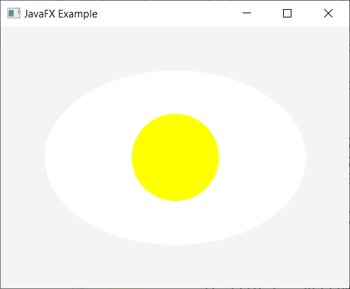
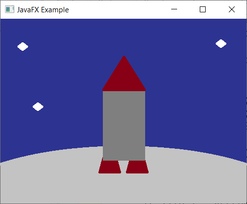

# POO - Lab 10 - Introdução ao JavaFX

Instituto Politécnico de Setúbal

Programação Orientada por Objetos

Licenciatura Engenharia Informática 2022/2023

## Ferramentas
* BlueJ
* JavaFX

# Objetivos
* Introdução ao uso de JavaFX

## Programa
* Introdução ao JavaFX

##  Regras de Implementação
* Criar a aplicação utilizando o IDE BlueJ.
* Implementar o código necessário e testar no fim de cada nível.
* Use as convenções de codificação adotadas para a linguagem Java (ver **Notas**).


# Introdução

Link para GitHub Classrooms: <a href="https://classroom.github.com/a/1QrhIBu9">https://classroom.github.com/a/1QrhIBu9</a>

O objetivo deste laboratório é a criação de um projeto JavaFX em BlueJ com o intuito de consolidar conhecimentos e praticar a matéria dada em aula.

Neste laboratório será desenvolvida uma aplicação de raiz que utilize o JavaFX para criar uma aplicação com vários componentes "Nodes". Terão de ser manipulados esses componentes através das propriedades cor, tamanho e rotação, como também translação.

# Nivel 1

Crie um novo projeto BlueJ e adicione uma nova classe chamada de "App", é de ter em consideração que será necessário escolher a opção "JavaFX" aquando a criação dessa classe.

Compile e corra a mesma. É possível analisar que uma nova janela é criada com um botão e com uma label. Essa é a aplicação "default" que criou uma aplicação que conta quantas vezes foi clicado no botão.

Vamos começar por dar um valor para a altura e largura da janela. Crie as constantes "WINDOW_WIDTH" e "WINDOW_HEIGHT" com os respetivos valores de **400** e **300** e utilize as mesmas variáveis na linha em que a "Scene" é criada.

Compile a classe e verifique o aumento das dimensões da janela.

# Nivel 2

De seguida iremos efetuar algumas mudanças na aplicação. Comente todo o código relativo ao botão e á "label" que existe no projeto sem esquecer de apagar também a função **buttonClick()**.

Altere a **GridPane** para uma **StackPane** e corrija os imports. A **StackPane** possibilita a sobreposição de itens facilmente. De seguida iremos desenhar um ovo estrelado, como está apresentado na figura 1.

Começaremos por fazer o import das **Cores** e das **Formas** geométricas: 
* import javafx.scene.shape.*;
* import javafx.scene.paint.Color;

Comece por criar uma variável "gema" que será a gema do ovo, essa variável será um circulo, altere a cor dessa forma através do método **setFill()** que receberá a cor **Color.YELLOW**. De seguida altere o tamanho e a forma do círculo com os métodos:
* setCenterX();
* setCenterY();
* setRadius();
* setFill()

Verifique se o círculo está a ser mostrado na janela da aplicação.

De seguida faça os mesmos passos para a clara do ovo, 
Atenção!! A clara será uma elípse e não um círculo. Por isso deverá criar uma **ellipse** e tenha atenção que a ellipse não tem o método **setRadius()**, mas sim **setRadiusX()** e **setRadiusY()**.

O resultado final deverá ser o seguinte:


## Nível 3

Para verificar mais uma funcionalidade, efetue uma rotação de 45 graus á clara através da função **setRotate()** e de seguidam adicione um prato vermelho com bordas vermelho escuro.


Crie agora um garfo, detalhe o garfo o melhor que puder, mas não precisará de ser muito parecido ao real.

Finalmente adicione o garfo á **scene** e verifique que o mesmo se encontra na janela da aplicação.

Adicione o seguinte código para que consiga mover o garfo por cima do comer

```java
// Adicionar fora da função start
double garfoX, garfoY;

// Adicionar dentro da função start
garfo.setOnMousePressed(e -> {
    garfoX = garfo.getLayoutX();
    garfoY = garfo.getLayoutY();
});
garfo.setOnMouseDragged(e -> {
    double offsetX = e.getSceneX() - garfoX - 25;
    double offsetY = e.getSceneY() - garfoY - 100;
    garfo.setTranslateX(offsetX);
    garfo.setTranslateY(offsetY);
});
garfo.setOnMouseReleased(e -> {
    // Updating the new layout positions
    garfo.setLayoutX(garfoX + garfo.getTranslateX());
    garfo.setLayoutY(garfoY + garfo.getTranslateY());

    // Resetting the translate positions
    garfo.setTranslateX(300);
    garfo.setTranslateY(0);
});

```
## Nível 4

* Crie uma nova aplicação JavaFX, e desenvolva a imagem que está na figura 3. Esta aplicação será similar á aplicação desenvolvida até ao nível 4, á excepção do número de Nós utilizados.

* Para fazer o planeta utilize uma esfera de tamanho superior á janela.

* Crie o foguetão, que extenderá de StackPane. Esta classe será necessária para o próximo nível.



## Nivel 5

* Com a cena desenvolvida, altere o código de forma a que seja possível mover o foguetão de forma similar ao garfo desenvolvido no nível 3.

* Se alterar as dimensões da janela o conteúdo pode ser omitido ou mostrar partes que não é suposto. Altere as propriedades da janela de forma a que não seja possível redimensioná-la.

## Valores recomendados

|       | Center(X,Y) | RadiusX/Y or Height/Width | Rotate | Color  | Translate(X,Y) | Stroke      |
|-------|-------------|---------------------------|--------|--------|----------------|-------------|
| Clara | 50,50       | 150,100                   | 45     | WHITE  | NONE           | NONE        |
| Gema  | 50,50       | 50                        | NONE   | YELLOW | NONE           | NONE        |
| Prato | 50,50       | 200                       | NONE   | RED    | NONE           | 50, DARKRED |
| Garfo | NONE        | 200,50                    | NONE   | GREY   | 300,0          | NONE        |


Notas:

Para os identificadores siga as convenções adotadas normalmente, em particular:
1. A notação camelCase para o nome das variáveis locais e identificadores de atributos e
métodos.
2. A notação PascalCase para os nomes das classes.
3. Não utilize o símbolo ‘_’, nem abreviaturas nos identificadores.