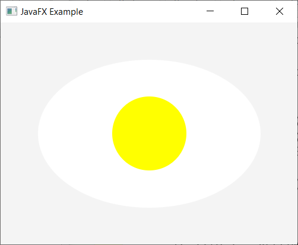
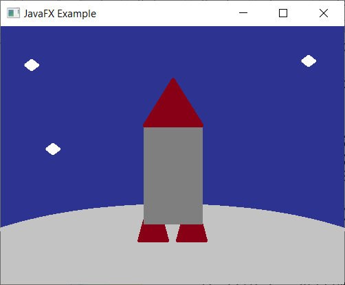

# OOP - Lab 10 - Introdução ao JavaFX

Instituto Politécnico de Setúbal

Object Oriented Programming

Degree in Computer Engineering 2022/2023

## Tools
* BlueJ
* JavaFX

# Objectives
* Introduction to using JavaFX

## Programs
* Introduction to JavaFX

## Rules of Implementation
* Create the application using the BlueJ IDE.
* Implement the required code and test at the end of each level.
* Use the coding conventions adopted for the Java language (see **Notes**).


# Introduction

Link to GitHub Classrooms: <a href="https://classroom.github.com/a/1QrhIBu9">https://classroom.github.com/a/1QrhIBu9</a>

The objective of this lab is the creation of a JavaFX project in BlueJ in order to consolidate knowledge and practice the subject matter given in class.

In this lab you will develop an application from scratch using JavaFX to create an application with several "Nodes" components. Terão de ser manipulados esses componentes através das propriedades cor, tamanho e rotação, como também translação.

# Level 1

Create a new BlueJ project and add a new class called "App", please note that you will need to choose the "JavaFX" option when creating this class.

Compile and run it. You can see that a new window is created with a button and a label. This is the "default" application that has created an application that counts how many times the button has been clicked.

Let's start by giving a value for the height and width of the window. Create the constants "WINDOW_WIDTH" and "WINDOW_HEIGHT" with respective values of **400** and **300** and use the same variables in the line where the "Scene" is created.

Now compile the class and check the increased dimensions of the window.

# Level 2

Next we will make some changes to the application. Comment out all the code for the button and the "label" that exists in the project without forgetting to delete the **buttonClick()** function as well.

Change the **GridPane** to a **StackPane** and fix the imports. The **StackPane** makes it easy to overlay items. Next we will draw a fried egg, as shown in figure 1.

We will start by importing the **Colors** and the **Shapes** geometry: 
* import javafx.scene.shape.*;
* import javafx.scene.paint.Color;

Start by creating a variable "yolk" which will be the egg yolk, this variable will be a circle, change the color of this shape through the **setFill()** method which will get the color **Color.YELLOW**. Next change the size and shape of the circle with the methods:
* setCenterX();
* setCenterY()
* setRadius()
* setFill()

Make sure that the circle is being shown in the application window.

Then do the same steps for the egg white, 
Attention! The white will be an ellipse and not a circle. So you must create an **ellipse** and be aware that the ellipse does not have the **setRadius()** method, but rather **setRadiusX()** and **setRadiusY()**.

The final result should look like this:


## Level 3

To check one more feature, rotate the egg white 45 degrees using the function **setRotate()** and then add a red plate with dark red borders.


Now create a fork, detail the fork as best you can, but it won't need to be very similar to the real thing.

Finally add the fork to the **scene** and verify that it is in the application window.

Add the following code so that you can move the fork over the food

```java
// Add outside the start function
double forkX, forkY

// Add inside the start function
fork.setOnMousePressed(e -> {
    forkX = fork.getLayoutX();
    forkY = fork.getLayoutY();
});
fork.setOnMouseDragged(e -> {
    double offsetX = e.getSceneX() - forkX - 25;
    double offsetY = e.getSceneY() - forkY - 100;
    fork.setTranslateX(offsetX);
    fork.setTranslateY(offsetY);
});
fork.setOnMouseReleased(e -> {
    // Updating the new layout positions
    fork.setLayoutX(forkX + fork.getTranslateX());
    fork.setLayoutY(forkY + fork.getTranslateY());

    // Resetting the translate positions
    fork.setTranslateX(300);
    fork.setTranslateY(0);
});

```

## Level 4

* Create a new JavaFX application, and develop the image that is in Figure 3. This application will be similar to the application developed up to Level 4, except for the number of Nodes used.

* To make the planet use a sphere larger than the window.

* Create the rocket, which will extend from StackPane. This class will be needed for the next level.



## Level 5

* With the scene developed, change the code so that it is possible to move the rocket in a similar way to the fork developed in level 3.

* If you change the dimensions of the window the contents may be omitted or show parts that are not supposed to. Change the properties of the window so that it cannot be resized.

## Recommended values

| | Center(X,Y) | RadiusX/Y or Height/Width | Rotate | Color | Translate(X,Y) | Stroke |
|-------|-------------|---------------------------|--------|--------|----------------|-------------|
| Light | 50,50 | 150,100 | 45 | WHITE | NONE | NONE |
| 50,50 | 50 | NONE | YELLOW | NONE | NONE |
| Plate | 50,50 | 200 | NONE | RED | NONE | 50, DARKRED |
| NONE | 200.50 | NONE | GREY | 300.0 | NONE |


Notes:

For identifiers follow commonly adopted conventions, in particular:
1. The notation camelCase for the name of local variables and identifiers of attributes and
attribute and method identifiers.
2. The PascalCase notation for class names.
3. Do not use the '_' symbol or abbreviations for identifiers.

