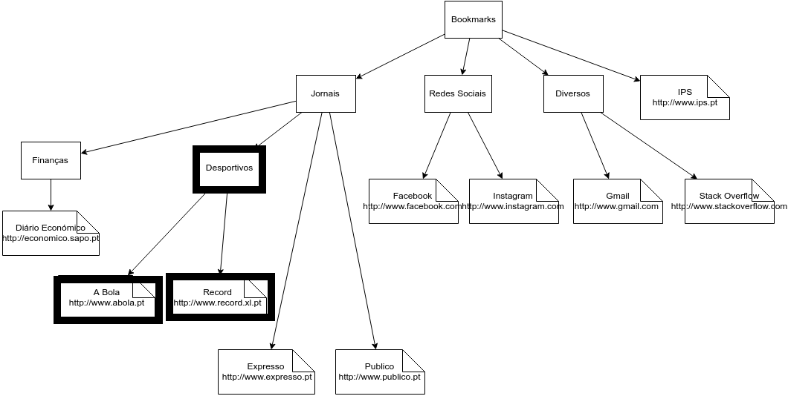

# Lab 3 - Enunciado

## Introdução

Considere que se pretende representar uma estrutura de Bookmarks como  apresentada na Figura 1


Para tal optou-se por usar o ADT Tree disponibilizada no package pt.pa.adts

A classe **BookmarkEntry** serve para representar pastas ou *bookmarks* concretos. No caso de pastas só é usada a chave (atributo “key”).

# 1 – Criação da classe BookmarkManager

* Crie a classe ***BookmarkManager\*** que será responsável por gerir um conjunto de *bookmarks* de um browser; 

* Adicione uma instância de ***TreeLinked\*** com nome *bookmarks*, que será manipulada posteriormente, de forma a que permita guardar um conjunto de elementos do tipo ***BookmarkEntry\***. A raíz da àrvore deverá conter inicialmente a pasta “*Bookmarks*”.

**NOTA:** Todos os métodos seguintes deverão ser implementados invocando métodos já implementados na classe *TreeLinked* (não é necessário fazer qualquer alteração na implementação da classe).


# 2 – Implementação dos métodos principais da classe

 Crie os seguintes métodos auxiliares (privados) na classe *BookmarkManager*:

* **Position<BookmarkEntry> find(String key)**

Devolve a posição na árvore do elemento com a chave especificada ou *null*, caso contrário. A comparação deverá ser realizada ignorando espaços à esquerda e à direita e sem levar em consideração a diferença entre minúsculas e maiúsculas.

* **boolean exists(String key)**

Verifica se existe algum elemento com a chave especificada.

 Implemente os seguintes métodos públicos na classe *BookmarkManager* (utilize os métodos auxiliares anteriores para realizar as validações necessárias):

* **void addBookmarkFolder(String keyParent, String keyFolder) throws BookmarkInvalidOperation**

Recebe a chave da pasta ascendente (*keyParent*) e da nova pasta (*keyFolder*) adicionando a última como descendente. Caso a pasta ascendente não exista, lança uma exceção com uma mensagem descritiva. Caso a chave *keyFolder* já exista, também deverá lançar uma exceção com uma mensagem apropriada.

* **void addBookmarkEntry(String keyParent, String keyEntry, String url) throws BookmarkInvalidOperation**

Implementação semelhante à anterior, mas aplicada a um *bookmark* efetivo.


# 3 – Implementação dos métodos que permitem obter informações da ADT

* **int getTotalFolders()**

Devolve o número total de pastas (a pasta *Bookmarks* não deve ser incluída).

* **int getTotalLinks()**

Devolve o número total de links.

* **int getTotalEntries()**

Devolve o número total de entradas (pastas e links).

* **String getParentFolder(String keyEntry) throws BookmarkInvalidOperation**

Devolve a *key* do *folder* ascendente associada à entrada enviada ao método que será do tipo *link*. Caso a *KeyEntry* não seja válida (não existe ou é do tipo *folder*) deverá lançar uma exceção.

 

Crie o método **toString** na classe **BookmarkManager**. Verifique o output gerado.

```java
public String toString() {
  return "BookmarkManager " +
         "size= " + bookmarks.size() + " " +
         "{\n" + bookmarks + "}";
}
```

 Complete o método *Main*, de forma a construir uma árvore como a que foi apresentada na figura 1 (acrescente o *folder* e os *bookmarks* realçados a negrito). 


# 4 – Implementação dos métodos que permitem mover um nó

 Adicione à interface Tree (e respetiva implementação) os seguintes métodos:

* **public boolean isAncestor(Position<E> posDesc, Position<E> posAsc)**

Verifica, recursivamente, se *posDesc* é descendente (direto ou indireto) de *posAsc*.

 

* **void move(Position<E> existingPosition, Position<E> newParent)**

Move (remove e insere) um nó da árvore e coloca-o como descendente de outro nó.

 

 Implemente na classe *BookmarkManager* o método **moveEntryToFolder** tendo particular atenção às seguintes restrições:

* O destino não poderá ser um *bookmark* final (*link*);

* O destino não poderá ser um nó descendente do nó a mover.

 

* **public void moveEntryToFolder(String origin, String destination)  throws BookmarkInvalidOperation**

 

Para verificar a correção do método **moveEntryToFolder** execute os seguintes passos:

* Adicione o novo *Folder* "**Extra**" à árvore de *bookmarks*.

* Mova a pasta "**Redes sociais**" para este novo *Folder*. Verifique o resultado.

* Mova a pasta "**Redes sociais**" para o link "**IPS**". Verifique o resultado.

* Mova a pasta "**Extra**" para a pasta "**Redes sociais**". Verifique o resultado.

* Se necessário, altere o método **main** de modo a que execute todo o código capturando o lançamento de exceções.

  

# 5 – Implementação de testes unitários

Implemente os testes unitários seguintes:

* **getTotalEntries_shouldReturnCorrectCounter();**

* **addBookmarkEntry_shouldThrowException_whenFolderKeyIsInvalid();**

* **moveEntryToFolder_shouldThrowException_whenDestinationIsNotFolder().**

 
