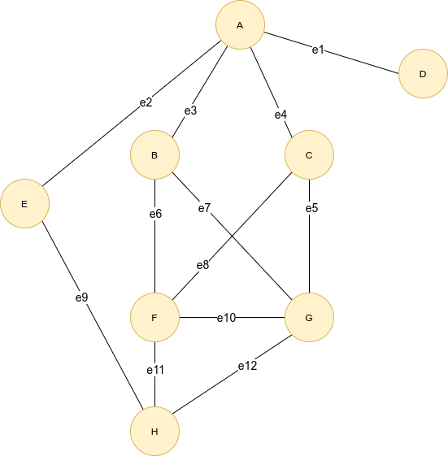

# ADT Graph Implementation

This repository contains the specification of the ADT Graph.

It also contains three partial implementations of the ADT, based on:

- Edge list;
- Adjacency List;
- Adjacency matrix (map).

Regarding these classes, you should follow the proposed exercises during class.

---

The `Main` class contains a program that initially creates the following graph:



The program should additionally do the following:

```
/* Answer the following questions through method calls and compare to the graph's illustration: 
        
    - What is the set of vertices?
    - What is the set of edges?
    - Is A adjacent to C ?
    - Is F adjacent to E ?
    - What are the incident edges of F ?
    - What is the opposite vertex of G via e7 ?
    - What is the opposite vertex of B via e9 ?
    
    - Remove F and repeat the above questions.
*/
```
