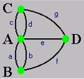
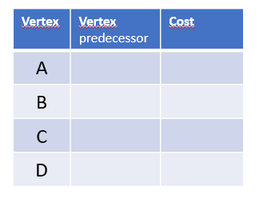
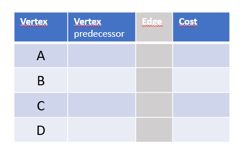

# ADT Map Template

Este repositório consiste num projeto IntelliJ de suporte à lecionação dos tipos abstratos de dados na linguagem Java, no contexto da unidade curricular de Programação Avançada - ESTSetúbal.

Os exercícios solicitados são os seguintes:

## Exercício 1.1
Este projeto contem integrada a api ADT_Graph.jar que disponibiliza uma implementação do ADT Graph.
Pretende-se manipular o ADT Graph. Para tal define-se instância um Grafo usando para vértice objectos do tipo `Local`e para arestas obejectos do tipo `Bridge`.

1. Complete o método `main`de forma a:
   1. Construir  o grafo ilustrado na figura.
   2. Mostrar todas as pontes que saiem do Local `A`
   3. Mostrar todos os locais vizinhos do Local `D`
   4. Determinar o número de pontes que partem de `C`
   5. Dado dois locais verificar se existe uma ponte que os liga diretamente.



## Exercício 1.2

Relembrando o pseudocódigo da travessia em profundidade - DFS

```pascal

    Algorithm: DFS(Graph,vertice_root)
    BEGIN
        setAsVisited(vertice_root)
        push(s,vertice_root)
        WHILE s is not EMPTY
            BEGIN
                v <- pop(s)     
                process(v)
                FOR EACH w adjacents(v)
                    IF w is not visited THEN
                        BEGIN
                            setAsVisited(w)
                            push(s,w)
                        END
            END                    
    END

```

Elabore um método na classe `TadGraphMain` que implemente o método DFS.

 **Nota** : Use a classe `java.util.Stack` para criar a instância do stack necessária.


## Exercício 2.1 (não existe codificação)


Pretende-se utilizar o algoritmo Dijkstra apresentado para calcular o caminho mais curto,entre dois pontos do grafo abaixo, assumindo os seguintes custos para percorrer as arestas

    * (a - 2)  (b -1)  (c - 3) (d - 1) (g - 4) (f - 4) (e - 15) 
  
1. Preencha a tabela que mostra o resultado da aplicação do algoritmo de Dijsktra , a partir do `Local A`.




- Consultando a tabela construindo anteriormente determine
  - Caminho de menor custo, para ir de A a D ? Qual o custo?

**Nota** Como saber qual a ponte atravessada se a `a` ou `b`??

2. De forma a saber qual a ponte percorrida entre dois locais (já que existem arestas paralelas), pretende-se modificar o algoritmo acima apresentado de forma a que este regista não só a lista de locais percorridos, **mas também as arestas percorridas**.

 * Preencha esta nova a tabela que mostra o resultado da aplicação do algoritmo de Dijsktra , a partir do `Local A`. Note que ela contem mais uma coluna. 


- Consultando a tabela construindo anteriormente determine
  - A sequencia de pontes percorridas para  para ir de A a D ao menor custo.
  - A sequencia de pontes percorridas para  para ir de B a C ao menor custo.

</small>

----

## Exercício 2.2 

O algoritmo de Dijkstra irá ser implementado sobre uma instância concreta do TAD Graph, tendo como objetivo de calcular o caminho de menor custo entre dois pontos do mapa de *Konisberg*.


- Os vértices são instanciados pela classe `Local`;
- As arestas são instanciadas pela classe `Bridge` (representa as pontes). Cada instância de Bridge terá um custo associado.

1. Implemente na classe `TadGraphMain` o método:

 ```java
 public int minimumCostPath(Vertex<Local> orig, Vertex<Local> dst, List<Vertex<Local>> localsPath)
 ```
que, a partir do vertice Origem e do vertice de Destino calcula o caminho mais curto. Para tal, deve implementar o **método auxiliar**:
 ```java
 /** * Performs the Dijkstra algorithm starting from 'orig'
     * @param orig the initial vertex
     * @param costs minimum cost from 'orig' to all the other vertex
     * @param predecessors predecessors along the paths
     */
    private void dijkstra(Vertex<Local> orig,
                          Map<Vertex<Local>, Double> costs,
                          Map<Vertex<Local>, Vertex<Local>> predecessors)`
 ```

2. Retifique o main, de forma a criar o mapa de *Konisberg* com os seguintes valores associados às pontes:

*  (a - 2)  (b -1)  (c - 3) (d - 1) (g - 4) (f - 4) (e - 15) 

3. Mostre a utilização do algoritmo para:
- Determinar o caminho de menor custo entre:
  -  O local B e o local C 
  -  O local A e o local D

4. Crie outro variante do método MinimumCostPath de forma a calcular a sequencia de pontes que inclui o caminho mais curto.

 ```java
 public int minimumCostPath(Vertex<Local> orig, Vertex<Local> dst, 
                            List<Vertex<Local>> localsPath, 
                            List<Edge<Bridge,Local>> bridgePath)
 ```
 
note que a sequência de pontes que compõem o caminho será "devolvido" através do parametro de entrada `List<Edge<Bridge,Local>> bridgePath`
 
 **Nota** : terá que implementar um novo método auxiliar 
 ```java
 private void dijkstra(Vertex<Local> orig,
                          Map<Vertex<Local>, Double> costs,
                          Map<Vertex<Local>, Vertex<Local>> predecessors
                          Map<Vertex<Local>,Edge<Bridge,Local>> edges)`
 ```
 onde o parametro `Map<Vertex<Local>,Edge<Bridge,Local>> edges` irá conter a informação sobre qual a aresta a percorrer (value), dado um vertice (key).

teste os novos métodos, na classe `TadGraphMain`.