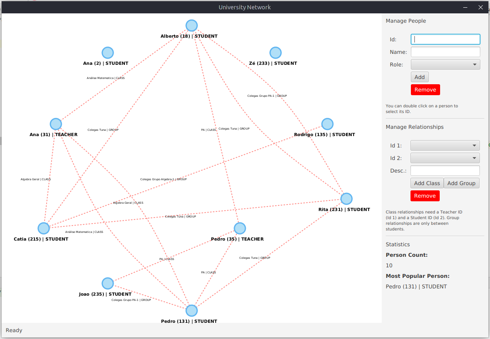
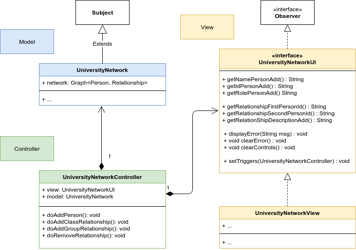

# Java Patterns - Model View Controller

This repository contains the code to create the following application:

## Architecture

The application is designed according to the MVC pattern:

## Exercises

1. Complete the code so the "*Statistics*" information is populated correctly.

3. Provide the code to allow **adding a new Person to the network**.

    - Check `setTriggers` in the *view* and `doAddPerson` in the *controller*.

4. Implement the functionality to **remove a person from the network**.

    - You must add functionality to *model*, *controller* and *view*.
    
    

