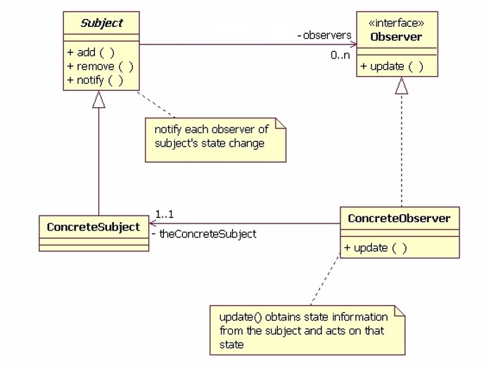

#Padrão Observer

## Objectivo
O padrão Observer também conhecido por (Subscriber/Publisher), permite que objectos "interessados" sejam avisados da 
mudança de estado ou de outros eventos ocorridos num outro objecto. 

## Solução



* Subject  
    * Conhece os seus observadores. Qualquer número de objectos Observer pode observar um Subject.
    * Fornece uma interface para adicionar e remover objectos Observer. 
*   ConcreteSubject  
     * Armazena os estados que interessam ao ConcreteObserver.
     * Envia uma notificação aos Observers, quando o estado se altera.
* Observer  
    * Define uma interface de alteração para os objectos que devam ser notificados de alterações verificados no Subject. 
* ConcreteObserver
    * Mantém uma referência para o objecto ConcreteSubject.
    * Armazena o estado consistente com o de Subject.
    * Implementa a interface de actualização definida em Observer,  para que o seu estado seja consistente com o de Subject.
 
 
# Implementação

* Como um dos problemas com este padrão é a classe Subject ser uma classe abstrata e não uma interfce, na implementação 
apresentada, define-se uma interface Observable, para dar maior flexibilidade à utilização do padrão
 
 ```java
public interface Observable {
    public void addObservers(Observer... observers);
    public void removeObservers(Observer observer);
    public void notifyObservers(Object obj);
}
```
 ```java
public abstract class Subject implements Observable{
    private List<Observer> observerList;
   
       public Subject() {
           this.observerList = new ArrayList<>();
       }
   
       @Override
       public void addObservers(Observer... observers) {
           for (Observer obs : observers) {
               if (!observerList.contains(obs))
                   this.observerList.add(obs);
           }   
       }
   
       @Override
       public void removeObservers(Observer observer) {
           this.observerList.remove(observer);
       }
   
       @Override
       public void notifyObservers(Object obj) {
           for (Observer observer : this.observerList)
               observer.update(obj);
   
       }
   }
```

 ```java
public interface Observer {
    /**
     * When a observer is notified execute this function
     * @param obj - argument of the method
     */
    void update(Object obj);
}
```

## Problema

* Pretendemos ter uma aplicação para gerir um carrinho de compras, e cada vez que um produto é adicionado ao
carrinho de compras o valor total é atualizado na consola.

* Para tal aplicou-se o padrão Observer

    * Concrete Subject - ShoppingCart
    * Concrete Observer - ShoppingCartTotalCost 


# Exercícios

1. Adicione uma nova classe que assume o papel de ConcreteObserver denominada `ShoppingCartListView` que tem como objectivo 
imprimir com o seguinte formato a lista de compras.
 Lista Ordenada por nome dos produtos
 
 ````
 <shopping cart name>
 <ordem>: <nome> - <cost> euros 
 ````

2. Faça as modificações necessárias no main, para adiconar ao `cart1`, este novo observador.

3. Adicione uma nova classe que assume o papel de ConcreteObserver denominada `ShoppingCartAllert`. Esta classe tem o atributo maxValue. Cada vez que este observador é notificado, verifica se o ultimo produto adicionado tem um valor superior ao máximo e imprime uma mensagem com a seguinte configuração:
  ````  
    "ALLERT!!! - The product <productName> has exceeded the maximum value configured <maxValue> 
 ```` 

4. Faça as modificações necessárias no main, para adicionar ao `cart2`, este novo observador.


 
 
