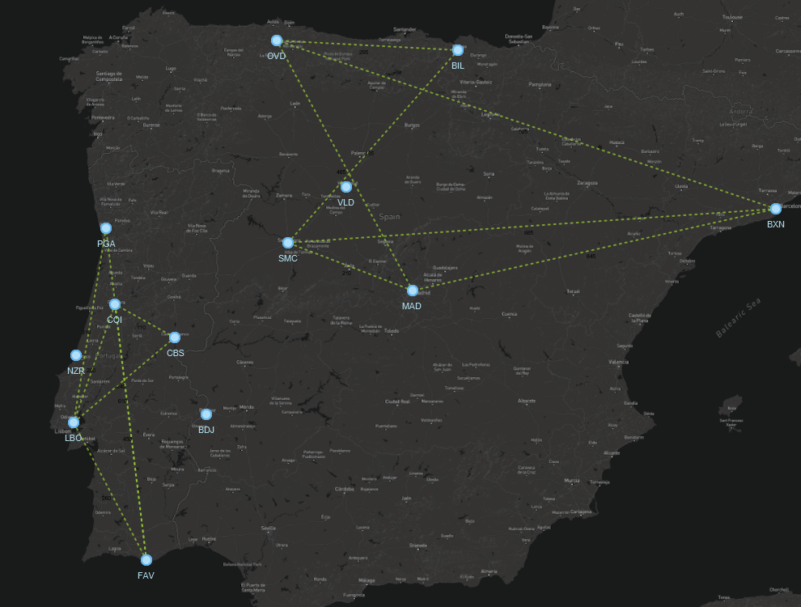
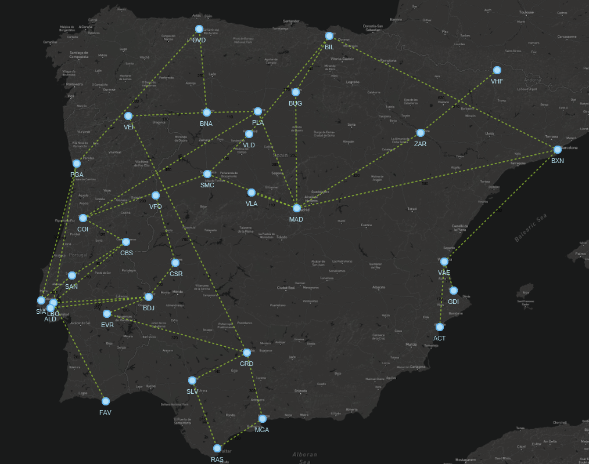
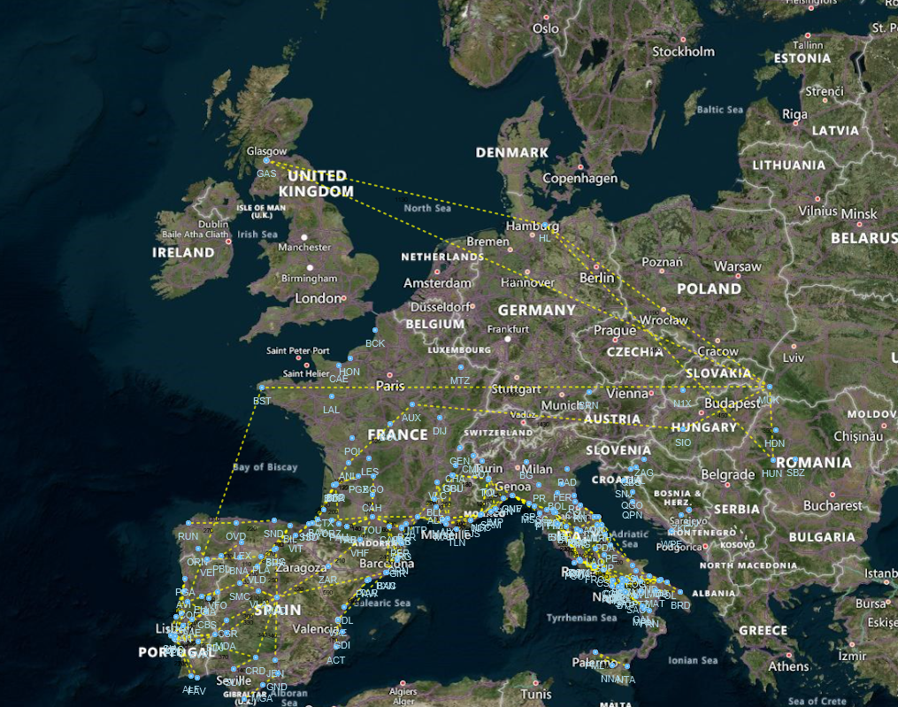

# Projeto PA 2022/23 - Época Normal

O enunciado do projeto encontra-se no Moodle.

Este template *IntelliJ* deve servir de base de desenvolvimento para este trabalho e o seu versionamento interno dentro de cada grupo feito através do *Git*.

## Resumo do Trabalho/Código Desenvolvido:

No âmbito da unidade curricular Programação Avançada, este projeto consiste numa Rede de Transporte de Autocarros
desenvolvida em linguagem de programação Java, tendo por estudo a implementação da teoria dos grafos, matéria abordada no decorrer da unidade curricular.

A Rede de Transporte de Autocarros é constituída pelas parte visual/gráfica, onde é declarado a localização (paragem) - “stop”  e a ligação (distância e duração) entre duas paragens - “route”, estando estas indicadas em código através do vértice "paragens (stops)" e arestas "rotas (routes)".    
Na implementação do código recorreu-se às estruturas de dados da "lista de adjacências".

Para a criação do modelo de dados foram implementados:

Nas *classes " Stop" e " Route"*;
- A *classe Stop* armazena os dados da cidade (nome e população).
 
- A *classe Route* armazena os dados (distância e duração).

- A *classe Reader* serve para ler os ficheiros das rotas *(routes-distance.txt)*, *(routes-duration.txt)*, dos *stops (stops.txt)* e das *coordenadas (xy.txt)*, e aplica as Stops.
- A *classe Path* tem os caminhos de testes *(DEMO, IBERIA, EUROPE)*.

- A *classe Tests*, é destinada para os testes unitários.

Na *classe GraphAdjacencyList*:

- `numVertices()` -> No graph, retorna o nº de vértices;

- `numEdges()` -> No graph, retorna o nº de edges ;

- `Vertices()` -> Retorna em Collection, os vértices;

- `existsVertexWith()` -> Caso exista o vértice element igual, retorna true, se não existir retorna false;

- `existsEdgeWithElement()` -> Caso exista o edge element igual, retorna true, se não existir retorna false;

- `insertVertex()` -> Insere um vértice no grafo;

- `areAdjacent()` -> Se os vértices estiverem conectados por um edge retorna true , se tal não acontecer retorna false;

- `incidentEdges()` -> retorna uma lista de incidentes no vértice;

- `Edges()` -> Retorna em Collection, os edges;

- `insertEdge()` -> Insere um edge conectado ao vértice;

- `opposite()` -> Retorna o vértice oposto, através do edge, se o edge e o vertex não estiverem conectados retorna null;

- `removeVertex()` -> Remove um vértice e retorna o element apagado;

- `removeEdge()` -> Remove um edge e retorna o element apagado;

- `replace()` -> substitui o element inserido (edge e do vertice);

- Na *Classe MyVertex*, existe dentro de um objeto vertex,uma lista de edges.

- Na *Classe MyEdge*, existe dentro de um objeto edge, dois vertices de entrada e saída.

## Mockups da interface gráfica idealizada para a aplicação:

- Mockup da interface gráfica Inicial da aplicação:

- Mockup da interface gráfica sobre a Localização (Paragem):

- Mockup da interface gráfica sobre Distâncias e Duração dos Percursos:

- Mockup da interface gráfica da Importação da Rede Transporte:

## Estrutura de ficheiros/pastas

- `/datasets` - contém os *datasets* a importar pela aplicação
- `/src` - contém o código-fonte da aplicação
    - `com.brunomnsilva.smartgraph` - *package* que contém a biblioteca [JavaFXSmartGraph](https://github.com/brunomnsilva/JavaFXSmartGraph). Não é esperado que tenha de fazer modificações a estas classes.
    - `pt.pa` - *package* principal da aplicação.
        - `*.graph` - *package* que contém o ADT Graph e uma implementação funcional baseada em "lista de arestas";
        - `*.model` - *package* que contém o modelo de classes da aplicação desenvolvida.
        - `*.view` - (a criar) *package* que contém as classes gráficas da aplicação desenvolvida.
    - `Main.java` - classe que contém o ponto de entrada para a aplicação.
- `/test` - (a criar) contém os testes unitários da aplicação
- `smartgraph.css` - *stylesheet* utilizado pela biblioteca JavaFXSmartGraph (pode alterar)
- `smartgraph.properties` - *propriedades* utilizadas pela biblioteca JavaFXSmartGraph (não é necessário alterar, já contém definições adequadas)
- `README.md` - este ficheiro. Podem alterar o conteúdo, se entenderem.

## Dados para importação

Os ficheiros estão em formato de texto, embora possam conter números; poderão existir comentários que começam pelo caráter `"#"` e devem ser ignoradas durante a leitura. Linhas em branco também deverão ser ignoradas. Cada ficheiro terá um cabeçalho indicativo das colunas, imediatamente antes da primeira linha de dados.

Os *datasets* encontram-se na pasta local `datasets`. Portanto, qualquer ficheiro localizado nessa pasta pode ser aberto com, e.g., `new FileReader("dataset/<folder>/<file>.txt")`, sendo `<file>` o ficheiro respetivo a abrir.

Existem três *datasets*:

- **demo** - (13 stops e14 routes);
- **iberia** - (32 stops e 38 routes);
- **europe** - (193 stops e 167 routes).

Cada dataset contem os seguintes ficheiros:

- `stops.txt` - Nomes das cidades onde estão localizadas as paragens de autocarro *stops*;
- `routes-distance.txt` - Lista de percursos  entre  *stops* e respetivas distâncias;
- `routes-duration.txt` - Lista de percursos  entre  *stops* e respetivos tempos;
- `xy.txt` - Coordenadas (de ecrã) das cidades onde estão localizados os *stops*;
- img/{nome-da-imagem}.png - Ficheiro(s) de imagem com possíveis fundos (mapa) a usar pela aplicação.

### Relação da informação entre ficheiros

Não existe qualquer ordem associada aos elementos nos vários ficheiros do dataset.  A relação entre as várias linhas de dados é feita usando o código da paragem (**stop_code**). 

### Exemplo de modelo importado

A título de exemplo, mostra-se o resultado esperado da importação dos *datasets*

### demo

### iberian

### europe

