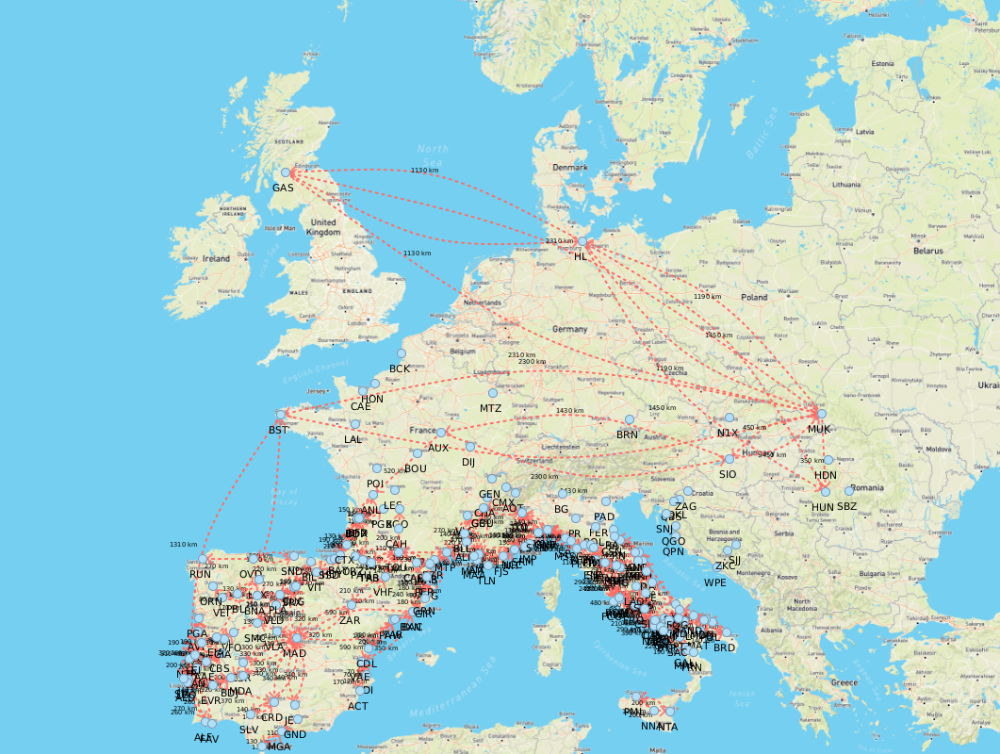

# Projeto PA 2022/23 - Época de Recurso

O enunciado do projeto encontra-se no Moodle.

Este template *IntelliJ* deve servir de base de desenvolvimento para este trabalho e o seu versionamento interno dentro de cada grupo feito através do *Git*.

## Estrutura de ficheiros/pastas

- `/datasets` - contém os *data sets* a importar pela aplicação
- `/src` - contém o código-fonte da aplicação
    - `com.brunomnsilva.smartgraph` - *package* que contém a biblioteca [JavaFXSmartGraph](https://github.com/brunomnsilva/JavaFXSmartGraph). Não é esperado que tenha de fazer modificações a estas classes.
    - `pt.pa` - *package* principal da aplicação.
        - `*.graph` - *package* que contém o ADT Graph e uma implementação funcional baseada em "lista de arestas";
        - `*.model` - *package* que contém o modelo de classes da aplicação desenvolvida.
        - `*.view` - (a criar) *package* que contém as classes gráficas da aplicação desenvolvida.
    - `Main.java` - classe que contém o ponto de entrada para a aplicação.
- `/test` - (a criar) contém os testes unitários da aplicação
- `smartgraph.css` - *stylesheet* utilizado pela biblioteca JavaFXSmartGraph (pode alterar)
- `smartgraph.properties` - *propriedades* utilizadas pela biblioteca JavaFXSmartGraph (não é necessário alterar, já contém definições adequadas)
- `README.md` - este ficheiro. Podem alterar o conteúdo, se entenderem.

## Dados para importação
Cada uma das pastas na pasta `datasets` representa um *data set* que contém um ficheiro `data.json` com seguinte informação no formato JSON:
- Objeto que contém toda a informação sobre as paragens (propriedade **stops**) e as rotas (propriedade **routes**).
    - A propriedade **stops** contém um *array* de objetos com a informação sobre cada paragem, sendo que cada um deles contém a seguinte informação:
        - **stopCode**: Código da paragem;
        - **stopName**: Nome das localidades onde as paragens estão localizadas;
        - **lat** e **lon**: Latitude e longitude das paragens;
        - **x** e **y**: Coordenadas *x* e *y* no ecrã para cada uma das paragens. Estes valores permitirão visualizar corretamente a localização relativa das várias paragens a nível geográfico.
    - A propriedade **routes** contém um array de objetos com a informação sobre cada rota, sendo que cada uma delas tem a seguinte informação:
        - **stopCodeStart** e **stopCodeEnd**: Código da paragem de origem e da paragem de destino, respetivamente;
        - **distance**: Distância entre as paragens (em Km);
        - **duration**: Duração da rota (em minutos).

Cada ficheiro `data.json` é acompanhado de uma pasta `img` que contém várias imagens do mapa associado a cada *data set* em diferentes estilos (`dark.png`, `map.png`, `satellite.png`, `terrain.png`).

No total existem três *datasets*:

- **demo** - (13 stops e 24 routes);
- **iberia** - (32 stops e 64 routes);
- **europe** - (192 stops e 276 routes).

### Exemplo de modelo importado

A título de exemplo, mostra-se o resultado esperado da importação dos *datasets*

### demo

### iberia

### europe

